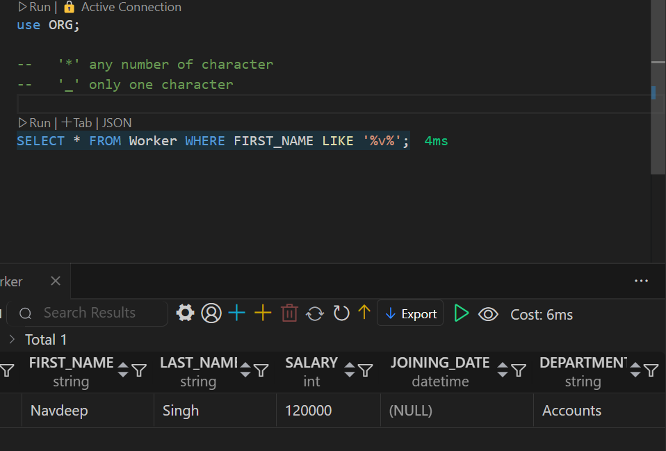

## Types of command

1. DDL (Data defination language)

    ``` it define relation schema```

    --> CREATE, ALTER TABLE, DROP, TRUNCATE, RENAME.

2. DRL/DQL (Data retriival language/ data query language)

    ``` it is used to retrieve data from Database```

    --> SELECT.

3. DML (Data Modification Language)

    ``` it is used to perform modification in the Database ```

    --> INSERT, UPDATE, DELETE

4. DCL (Data Control Language)

    ``` it is used to grant or revoke authorities from user ```

    --> GRANT, REVOKE.

5. TCL (Transaction control Language)

    ``` it is used to manage transactions done in the Database ```

    --> SMART TRANSACTION, COMMIT, ROLLBACK, SAVEPOINT.


# Famus Interview Questions

1. Can we use SELECT keyword without using FROM clause?

Ans ``` yes, Using DUAL Table, Dual table are dummy tables created by MYSQL, help user to do certain obvious actionswithout referring to user defined tables ```

Example ``` SELECT 55+11, SELECT now(), SELECT ucase(), SELECT lcase(); ``` etc


2. Find the employee in the table whose name contain character 'V'

    ``` Hint  pattern Searching ```

Ans  DQL > Pattern_Searching.sql
